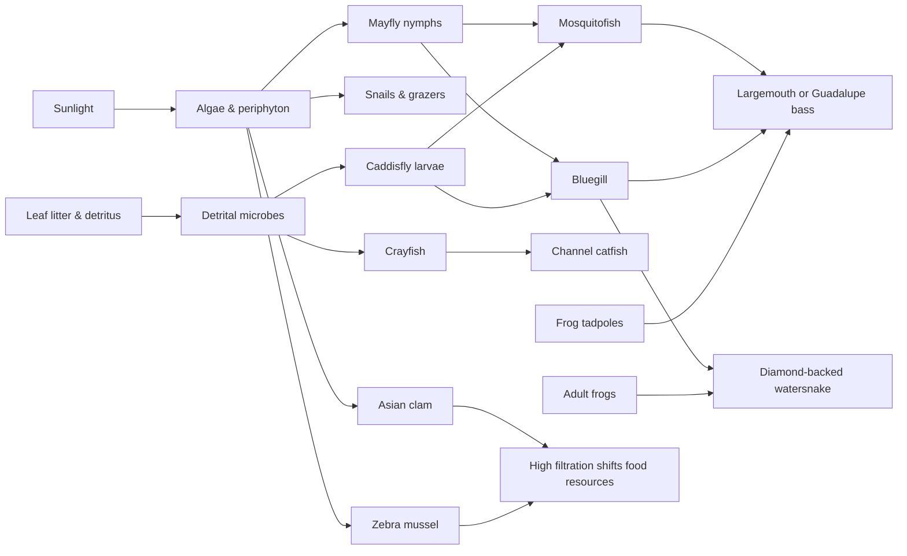
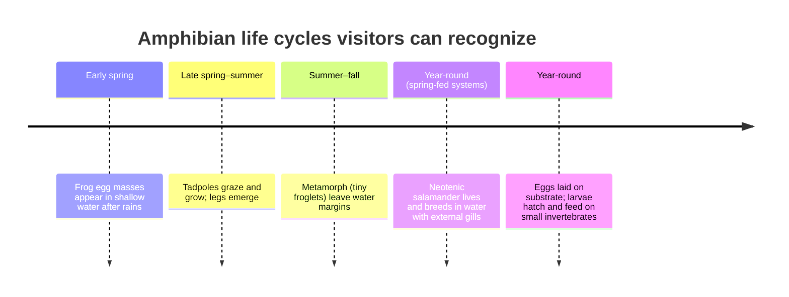

# Amphibians and Aquatic Wildlife of and

## Executive summary

The entity["place","Central Texas","edwards plateau region, us"] “park-water” experience—creeks that flash after storms, spring-fed runs that stay cool, and pond edges that warm quickly—creates a mosaic of aquatic habitats within a short drive. A major reason this region is so biologically distinctive is its underlying karst geology: much of the area’s water moves through fractured limestone, caves, and porous rock associated with the entity["place","Edwards Aquifer","balcones fault zone, tx"] system, producing springs and spring runs that can be remarkably stable in temperature and chemistry. citeturn26search0turn31view1

That stability supports a globally significant set of aquatic endemics—especially neotenic (forever-gilled) salamanders that live in spring outlets, gravel beds, and even subterranean voids. Several local salamanders are protected under the U.S. Endangered Species Act and are tightly tied to spring flow, clean water, and undisturbed streambed substrates. citeturn31view1turn35search6turn32search5turn32search12

For signage and visitor education, amphibians are especially valuable “storytellers” because their permeable skin and reliance on water during reproduction mean they often respond quickly to habitat change. In other words: when frogs and salamanders are thriving, the creek or pond is often doing something right—and when they vanish, it can be an early warning that water quality, flow, or shoreline habitat has shifted. citeturn26search15turn27search2

Invasive aquatic species are an equally important part of the Central Texas story. Filter-feeding mussels and clams, plus introduced fish, can reshape food webs, compete with natives, and spread between lakes on boats and gear. Texas regulations prohibit transporting aquatic invasive species, and state rules require “drain water” steps when leaving or approaching public freshwater—particularly relevant in a region of heavily used reservoirs and community fishing lakes. citeturn26search2turn41view0

## Priority species comparison table

| Common Name | Scientific Name | Native/Invasive | Typical Park Habitat | Key ID Features | Signage Placement |
|---|---|---|---|---|---|
| Barton Springs Salamander | *Eurycea sosorum* | Native | Spring outlets, spring runs, clean gravel/rock | Slender; mottled “salt-and-pepper”; bright red external gills; always aquatic | Spring outflow overlook; “look, don’t touch” substrate zones |
| Austin Blind Salamander | *Eurycea waterlooensis* | Native | Subterranean aquifer; occasionally visible at spring outlets | Pale/whitish to lavender; reduced eyes (eyespots); extended snout; external gills | Spring outlet fence line; interpretive “life underground” panel |
| Jollyville Plateau Salamander | *Eurycea tonkawae* | Native | Spring-fed creeks, spring runs, wet caves | Brownish, gilled, aquatic; hidden under rocks/gravel in shallow runs | Spring run trail bridge; “flip-free zone” signage |
| Gulf Coast Toad | *Incilius nebulifer* | Native | Rain-filled pools, ditches, pond margins, neighborhood greenbelts | Warty skin; cranial crests; loud trilling call after rains | Trailhead rain-pool hotspot; seasonal “listen at night” QR |
| American Bullfrog | *Lithobates catesbeianus* | Native | Permanent ponds/lakes, slow backwaters | Very large frog; big tympanum; deep “jug-o-rum”; huge tadpoles | Pond boardwalk/overlook; “watch the shoreline” post |
| Red-eared Slider | *Trachemys scripta elegans* | Native | Slow water with mud bottoms and basking logs | Red stripe behind eye; stacks of basking turtles; quick “slide” splash | Pond edge or viewing platform; basking-log interpretive sign |
| Texas Map Turtle | *Graptemys versa* | Native | Rivers/streams in Colorado River basin; also reservoirs | “Map-like” head/neck lines; orange post-orbital marks; females much larger | River overlook near current breaks and basking logs |
| Guadalupe Bass | *Micropterus treculii* | Native | Flowing Hill Country streams, riffles/pools | Texas endemic; favors running water; often near rock/woody cover | Creek crossing or riffle-view pullout; angler education QR |
| Channel Catfish | *Ictalurus punctatus* | Native | Deeper pools, larger streams, reservoirs | Whiskers; deeply forked tail; juveniles often spotted | Bridge/culvert pool sign; nighttime “bottom feeder” QR |
| Asian Clam | *Corbicula fluminea* | Invasive | Sand/gravel/mud in streams, lakes, reservoirs | Small, ridged shell; often scattered shells on shore | Shoreline “shell ID” sign; invasive awareness QR |
| Zebra Mussel | *Dreissena polymorpha* | Invasive | Hard surfaces in lakes/reservoirs; boats, docks, rocks | Small striped shells; dense clusters; sharp edges | Boat ramp / dock entrance; “Clean, Drain, Dry” QR |

This table prioritizes species that are both commonly encountered by visitors and especially useful for understanding local water ecology, based on regional species accounts and Texas invasive monitoring. citeturn31view1turn35search6turn32search5turn41view0turn41view1turn36view0turn36view2

## Mermaids and visual assets

image_group{"layout":"carousel","aspect_ratio":"16:9","query":["Barton Springs salamander Eurycea sosorum underwater","Jollyville Plateau salamander Eurycea tonkawae spring run","Austin blind salamander Eurycea waterlooensis photo","American bullfrog Lithobates catesbeianus pond edge","Texas map turtle Graptemys versa basking on log","zebra mussel cluster on boat hull Texas"] ,"num_per_query":1}

Recommended signage visuals (high-impact, field-useful):
- A “life stages” strip for one frog (egg mass → tadpole → metamorph → adult) and one spring salamander (egg → larva-like juvenile → neotenic adult with gills). citeturn39view0turn31view1  
- A “look-alikes” panel: Red-eared Slider vs. Texas River Cooter vs. Texas Map Turtle (head markings, shell pattern, basking behavior). citeturn42view0turn19search8turn43view0  
- A “stream-bottom bioindicator” graphic showing mayfly and caddisfly larvae silhouettes and what their presence suggests about water quality. citeturn27search2turn27search11turn28search0turn28search14  
- A boat-ramp “invasive hitchhikers” graphic highlighting zebra mussels (clusters) and Asian clams (loose shells), paired with the Texas-required drain-and-dry message. citeturn26search2turn41view0turn41view1  

Mermaid chart (aquatic food-web snapshot for typical creek/pond edges):

This simplified web reflects documented feeding roles (insect-based energy flowing into small fish, then into larger predators), the importance of benthic insects as indicators, and the strong filtration effects associated with invasive bivalves. citeturn27search2turn27search11turn36view2turn39view0turn41view1turn41view0

Mermaid chart (representative life-cycle timeline: frog vs. neotenic spring salamander):

Eggs, larvae/tadpoles, and metamorph stages are among the most reliable “signage moments” for families and school groups; spring salamanders are especially notable because adults retain larval traits (external gills) for life. citeturn39view0turn31view1turn31view0

## Species entries

American Bullfrog  
Lithobates catesbeianus  

Native  

Description  

The American Bullfrog is the heavyweight of Central Texas frogs—thick-bodied, long-legged, and often noticeably larger than any nearby leopard frog or chorus frog. Adults are typically green to brown with darker mottling, a pale underside, and fully webbed back feet built for powerful swimming. A classic field mark is the large round tympanum (external ear); on many adult males it appears noticeably larger than the eye. citeturn23search3turn13view0  

Bullfrogs breed in water, and their life cycle is easy to spot if you visit a pond repeatedly: egg masses in shallow margins, followed by very large tadpoles that can persist for a long time before becoming froglets. When calling, males announce themselves with a deep “jug-o-rum” that carries across still water—often the sound you hear before you ever see the frog. citeturn23search3turn13view0  

Habitat  

Bullfrogs favor permanent water: ponds, small lakes, reservoirs, slow creek pools, and even human-made canals or culverts when water persists. They do best where shorelines provide both cover (vegetation, roots, submerged branches) and open water for hunting. In the Austin-area landscape, bullfrogs are most consistent in year-round waters—especially where summer heat would dry temporary pools used by other frogs. citeturn23search3turn13view0  

Where Found In The Park  

Look for bullfrogs where the bank transitions from emergent plants to deeper water—especially near partially submerged logs, cattails, or shaded edges under overhanging brush. In daylight, they often sit motionless at the waterline; at night, eyeshine may reveal them at the edge of a beam. citeturn23search3  
- Pond boardwalk corners and fishing piers  
- Slow backwaters below small dams or trail bridges  

Ecological Role  

Bullfrogs are major predators at the pond edge, feeding on a wide range of prey and serving as prey for larger fish, turtles, snakes, and wading birds. Their long-lived tadpoles also function as important grazers and “energy storage,” converting algae and detritus into animal biomass that later feeds predators. citeturn23search3turn42view3  
- Helps regulate aquatic and shoreline insect populations  
- Provides food for water snakes, snapping turtles, and fish-eating birds  
- Tadpoles recycle nutrients by grazing and stirring organic matter along margins  

Fun Fact  
- Bullfrog males can be sexed in the field by comparing tympanum size to the eye—males typically have a larger tympanum. citeturn23search3  
- Bullfrogs are strongly associated with permanent water; if a pond dries completely each year, bullfrogs are often absent while spadefoots may still breed after rains. citeturn23search3turn23search2  

Rio Grande Leopard Frog  
Lithobates berlandieri  

Native  

Description  

The Rio Grande Leopard Frog is a common, medium-to-large frog of warm-water Texas landscapes, usually recognized by irregular dark spots on a lighter background and pale dorsolateral folds (raised lines) running along the back. Color varies widely—greenish, tan, or brown—often matching shoreline vegetation or muddy banks. Compared to bullfrogs, leopard frogs look more streamlined and tend to sit with a ready-to-spring posture on the edge of shallow water. citeturn10view1turn13view0  

This species’ life cycle follows the familiar egg → tadpole → froglet → adult pattern, and adults may be active much of the warm season. Listening is often the best identification tool: breeding calls can be heard near shallow edges and temporary waters after rains, and the TPWD call library is especially useful for confirming what you’re hearing in the field. citeturn10view1turn13view0  

Habitat  

Rio Grande Leopard Frogs use a broad range of aquatic habitats: ponds, marshy margins, slow creek pools, and irrigation-style ditches where water lingers. They are often associated with vegetated shorelines and shallow water where tadpoles can feed and hide. In the Cedar Park/Austin area, they are especially likely in warm, low-gradient park ponds and calmer creek reaches that maintain water through dry spells. citeturn10view1turn13view0  

Where Found In The Park  

Scan the transition zone between emergent plants (cattails, sedges) and open water. You’ll often find leopard frogs sitting on muddy banks, floating at the surface with only eyes and nostrils exposed, or tucked into shoreline vegetation. citeturn10view1  
- Pond edges and wetland margins  
- Calm creek pools near trail crossings  

Ecological Role  

Leopard frogs are strong “middle links” of aquatic food webs—eating insects and other invertebrates, while being eaten by snakes, turtles, larger fish, and birds. Their tadpoles also help process algae and fine organic matter, contributing to nutrient cycling in shallow water. citeturn10view1turn42view3  
- Reduces mosquito and midge production by consuming larvae and adults  
- Provides prey for water snakes and wading birds  
- Tadpoles recycle nutrients and help convert algae into animal biomass  

Fun Fact  
- Leopard frogs show wide color variation; two frogs from the same pond can look strikingly different while still being the same species. citeturn10view1  
- The TPWD call archive is one of the most practical “field tools” for visitors: many frogs are heard far more often than they are seen. citeturn13view0  

Plains Leopard Frog  
Lithobates blairi  

Native  

Description  

Plains Leopard Frogs are patterned frogs with distinct spots and a generally “leopard” look, often confused with other leopard frog species at a glance. They typically show rounded dark spots on a lighter tan/green backdrop and have dorsolateral folds along the back. Adults are medium-sized, with strong hind legs and a quick, bounding escape into water when surprised. citeturn10view0turn13view0  

Like many frogs, their most obvious seasonal signs are tied to breeding: calling near water, egg masses in protected shallows, and later the appearance of tadpoles and small froglets along the bank. Because leopard frogs can be challenging for beginners, pairing a signage photo with a QR link to calls is a high-value identification aid. citeturn10view0turn13view0  

Habitat  

Plains Leopard Frogs use a mix of still and slow-moving waters, including ponds, wetlands, and creek pools. They often rely on edge habitat—shallow water with plants for cover and nearby open ground for foraging. In park settings, they frequently occupy pond margins and calmer stream reaches that maintain aquatic vegetation and avoid constant scouring flows. citeturn10view0turn13view0  

Where Found In The Park  

Expect them at pond edges with mixed vegetation and open mud, especially near shallow coves where tadpoles can persist. At night, look for eyeshine along the bank; by day, watch for sudden splashes when you approach quietly. citeturn10view0  
- Wetland margins and shallow pond coves  
- Calm pools adjacent to riffles  

Ecological Role  

Plains Leopard Frogs consume insects and other small invertebrates and, in turn, support a wide range of predators in aquatic and riparian food webs. Their eggs and tadpoles are also important seasonal food pulses for fish and aquatic insects when breeding is successful. citeturn10view0turn42view3  
- Helps control insect populations around water  
- Supports predators including fish, snakes, turtles, and birds  
- Tadpoles contribute to nutrient cycling in shallow water  

Fun Fact  
- Leopard frogs are a classic “edge species”—many sightings happen within a few feet of the shoreline rather than in deeper water or far uplands. citeturn10view0  
- Calls can confirm identity when multiple spotted frogs share a habitat; signage QR audio is often more reliable than a brief visual glimpse. citeturn13view0  

Blanchard’s Cricket Frog  
Acris blanchardi  

Native  

Description  

Blanchard’s Cricket Frogs are small, energetic frogs often noticed as quick “skips” along the shoreline rather than as a still silhouette. They are typically only a few centimeters long, with variable mottling that can look gray, brown, or greenish, and many individuals show a dark triangular mark between the eyes. Their skin can appear slightly “rough,” and they often tuck into tiny crevices between rocks or shoreline debris. citeturn14search0turn13view0  

The most memorable identifier is sound: males produce a rapid series of sharp clicks—often compared to pebbles being tapped together—which can be heard from mats of vegetation at the water’s edge. Egg laying and tadpole development occur in shallow nearshore water, and newly transformed froglets may appear in large numbers during warm months when conditions are right. citeturn14search0turn13view0  

Habitat  

Cricket frogs use a mix of aquatic and terrestrial edges, typically staying close to streams, shallow lakes, or ponds with vegetated shorelines and wet muddy banks. They often prefer slow-moving or still water margins with submerged plants or algae mats that provide calling platforms and cover. In Central Texas parks, they are especially likely along gentle-slope banks where shallow water persists along the edge even if the center of a pond becomes warm and open. citeturn14search0  

Where Found In The Park  

Look low and close: cricket frogs often sit on exposed mud flats at the waterline, on floating vegetation, or among small shoreline rocks. If you walk a pond edge and see several tiny frogs hopping only a few feet ahead of you, cricket frogs are often the culprit. citeturn14search0  
- Shallow pond shelves and mud flats  
- Creek edges with algae mats or low vegetation  

Ecological Role  

Cricket frogs are significant insect consumers for their size and serve as prey for a wide range of predators. Because they rely heavily on shoreline microhabitat, they can be sensitive to bank hardening, loss of vegetation, or sudden water-level swings that remove the shallow edge zone. citeturn14search0turn27search2  
- Helps control small insects near water  
- Feeds birds, snakes, and larger fish  
- Links shoreline insect production to higher trophic levels  

Fun Fact  
- Their clicking call is one of the easiest frog sounds to learn—once you recognize it, you’ll start hearing cricket frogs in many vegetated ponds. citeturn14search0  
- Cricket frogs often “hug the edge”; even a narrow strip of shallow water and plants can be enough to support a chorus. citeturn14search0  

Canyon Treefrog  
Dryophytes arenicolor  

Native  

Description  

Canyon Treefrogs are medium-sized treefrogs with a rugged look: warty, textured skin that helps reduce water loss in dry landscapes, and a coloration that can blend into rock and bark—gray, brown, or greenish tones with darker mottling. They have strong toe pads for climbing, and although they are “treefrogs,” they are often found on rock faces and ledges near water rather than high in trees. citeturn14search13turn13view0  

For visitors, one of the most consistent clues is place: if you find a small frog clinging to limestone or rock near a seep, spring run, or shaded creek wall, a canyon treefrog is a strong candidate. Calling often follows warm rains; pairing a QR audio reference with a photo is especially helpful because these frogs can be cryptic and disappear into rock crevices when approached. citeturn14search13turn13view0  

Habitat  

Canyon Treefrogs are strongly associated with rocky habitats that stay close to water—springs, seeps, rocky creek corridors, and shaded cliff-like banks. In the Austin-area limestone landscape, that often means places where groundwater seepage or persistent shade keeps surfaces damp even when surrounding uplands are dry. They typically use crevices and cracks as daytime refuges, emerging to feed and breed when moisture conditions are favorable. citeturn14search13  

Where Found In The Park  

Focus on rock: limestone outcrops near creeks, stone retaining walls close to water, shaded bridge abutments, and rocky spring runs. Search with your eyes, not your hands—these frogs often sit in narrow cracks where disturbance can injure them. citeturn14search13  
- Limestone creek corridors and seep zones  
- Shaded culverts or rocky bridge walls near water  

Ecological Role  

Canyon treefrogs convert shoreline insect life into amphibian biomass and provide prey for snakes, birds, and larger aquatic-edge predators. Because they depend on localized moisture refuges, they benefit from intact riparian shade and clean seep/spring flows. citeturn14search13turn27search2  
- Consumes insects in rocky riparian corridors  
- Supports predators that hunt along water-rock edges  
- Highlights the value of shaded, moisture-retaining microhabitats  

Fun Fact  
- Their textured skin is an adaptation for life where water can be scarce—helping them resist drying compared with many smoother-skinned treefrogs. citeturn14search13  
- In many parks, the “where” is the best identifier: rock-and-water together is the canyon treefrog’s signature combination. citeturn14search13  

Strecker’s Chorus Frog  
Pseudacris streckeri  

Native  

Description  

Strecker’s Chorus Frog is a small frog whose most reliable “field mark” is often its voice: males call during breeding with a distinctive chorus that can dominate a wet night, even when the frogs themselves remain hidden. Visually, chorus frogs are typically small, with variable brown/gray coloration and patterning that helps them vanish in leaf litter and shoreline grasses. citeturn13view0turn21search18  

Because sightings can be brief, the best signage strategy is to teach visitors what to look for around breeding time: the sound near shallow water, small egg masses in temporary pools, and later the appearance of tiny froglets dispersing into grass. In Central Texas, chorus frogs often “announce” the return of seasonal water in low spots after rains. citeturn13view0turn21search18  

Habitat  

Chorus frogs generally rely on shallow, seasonally available water for breeding—temporary pools, rain-filled depressions, and quiet pond margins that are warm and sunlit enough for fast development. They then spend much of their time in nearby terrestrial cover (grasses, leaf litter, low vegetation), returning to water primarily for breeding and larval development. citeturn13view0turn21search18  

Where Found In The Park  

You are most likely to encounter Strecker’s Chorus Frog as sound rather than sight. Visit low, rain-catching areas—shallow pond shelves, wetland margins, and grassy swales near trails—on warm evenings after rains and listen for a concentrated chorus. citeturn13view0  
- Seasonal puddle zones near trail edges  
- Shallow wetland margins and grassy swales  

Ecological Role  

Chorus frogs are classic “pulse breeders,” taking advantage of short windows when temporary water exists. That strategy helps them avoid some permanent-water predators, while providing seasonal bursts of food (eggs, tadpoles, froglets) for wading birds, snakes, and fish when waterways connect. citeturn27search2turn13view0  
- Consumes insects and other small invertebrates  
- Provides seasonal prey pulses for larger predators  
- Signals functional seasonal wetland habitat in urbanizing landscapes  

Fun Fact  
- Many visitors first learn chorus frogs by ear: a QR call clip can turn a “mystery night sound” into a confident identification. citeturn13view0  
- Chorus frogs often breed in water that lasts only weeks—an effective way to reduce exposure to fish that eat tadpoles. citeturn27search2  

Gulf Coast Toad  
Incilius nebulifer  

Native  

Description  

The Gulf Coast Toad is a sturdy, warty toad with prominent cranial crests and a build designed for life on land—until rain triggers breeding. Color varies from gray-brown to olive, usually with darker blotches, and the skin has the dry, bumpy texture typical of true toads. Compared with many frogs, toads often move by short hops or purposeful walking, especially when hunting insects on warm nights. citeturn13view0turn22search1turn22search2  

Its most memorable sign is sound: after rains, males can produce loud trills from the edges of shallow water, and choruses may erupt in neighborhood ponds, ditches, and park wetlands. Eggs are laid in strings (a toad hallmark), and tadpoles develop in warm, shallow pools that may be temporary. citeturn13view0turn22search1  

Habitat  

Gulf Coast Toads occur in a wide range of natural and human-altered habitats where temporary water appears for breeding and where adults can find daytime shelter (leaf litter, burrows, debris, vegetation). In Central Texas parks, they are often associated with rain-fed margins—shallow pond shelves, wet ditches, and low spots that hold water briefly after a storm, especially in warmer months. citeturn22search1turn13view0  

Where Found In The Park  

Look for them near trailheads and open grassy areas adjacent to ponds or drainage swales—particularly on warm evenings after rain. During the day they may be hidden under cover; at night they may sit under lights hunting insects drawn to the glow. citeturn22search1  
- Wetland margins and temporary rain pools  
- Lit park facilities near water (restrooms, pavilions)  

Ecological Role  

Gulf Coast Toads are important insect predators and also serve as prey for snakes, birds, and larger aquatic-edge predators. Because they breed quickly in warm shallow pools, they help convert “stormwater moments” into wildlife productivity—when pools persist just long enough for tadpoles to develop. citeturn27search2turn22search1  
- Reduces night-flying and ground-dwelling insect numbers  
- Feeds snakes and other riparian predators  
- Highlights the ecological value of temporary water in urban parks  

Fun Fact  
- Many “toad nights” happen right after the first warm rains—some park ponds that seem quiet by day become loud amphibian hubs overnight. citeturn22search1  
- The TPWD call archive includes Gulf Coast Toad recordings and is one of the fastest ways to confirm identification by ear. citeturn13view0  

Great Plains Toad  
Anaxyrus cognatus  

Native  

Description  

Great Plains Toads are medium-to-large toads often recognized by their bold dorsal blotches—large, dark greenish patches outlined against an olive or gray-brown background. Their skin is warty and dry-looking, and they may show a faint pale stripe down the back. In the hand (or in a clear photo), they look rugged and strongly built for a life of digging and enduring hot, dry conditions between rains. citeturn24search4turn13view0  

Breeding is closely tied to rain: adults may surface and move quickly to shallow water, where males call and eggs are laid in strings. Tadpoles then race through development in warm, often temporary pools—one reason this toad can succeed in landscapes where permanent ponds are scarce or heavily predator-filled. citeturn24search4turn13view0  

Habitat  

Great Plains Toads occupy open habitats and can use temporary pools, roadside ditches, and shallow pond edges for breeding. In parks, they often rely on rain-filled depressions with soft sediment, and adults spend much of their time hidden in burrows or under cover to reduce water loss. In the Cedar Park/Austin region, they may appear suddenly after storms—especially in open grass-dominated areas near shallow water. citeturn24search4turn13view0  

Where Found In The Park  

After warm rains, listen near shallow, open-water edges and low grassy swales that hold water briefly. By day, they’re usually hidden; by night, they can be active on trails and in open areas hunting insects. citeturn24search4  
- Rain-pool basins in open fields  
- Shallow pond margins with soft sediment  

Ecological Role  

As strong insect predators, Great Plains Toads help regulate beetles, ants, and other ground-active insects. Their rapid breeding response to storms creates a short-term “boom” of eggs and tadpoles that can feed aquatic predators and speed nutrient cycling when water bodies temporarily connect. citeturn24search4turn27search2  
- Controls insects in grassland and park-edge habitats  
- Provides seasonal prey for snakes and wading birds  
- Converts stormwater pooling into wildlife production  

Fun Fact  
- Great Plains Toads can be absent for long stretches, then appear overnight after a rainstorm—an effective strategy in climates with unpredictable water. citeturn24search4  
- Their bold blotches are a practical field mark: many other local toads are more uniformly mottled. citeturn24search4  

Woodhouse’s Toad  
Anaxyrus woodhousii  

Native  

Description  

Woodhouse’s Toad is a robust, warty toad often identified by a pale stripe down the center of the back and relatively large parotoid glands behind the eyes. Overall color ranges from gray-green to brown with darker spots, and the underside is often pale with little pattern. For many visitors, the “feel” of the animal—dry, textured skin and a stout body—matches the classic idea of a toad. citeturn23search12turn24search0turn13view0  

Breeding is tied to water availability: males call from or near standing water, and eggs are laid in long gelatinous strings in shallow breeding sites. Tadpoles develop in these waters, then transform into small toadlets that disperse onto land to hunt insects. citeturn24search3turn13view0  

Habitat  

Woodhouse’s Toad uses a variety of landscapes but typically breeds in still or slow water—including pools, ponds, and other standing-water habitats. In Central Texas parks, that often means pond margins, low still pockets along creeks, and rain-created pools that persist long enough for development. Adults can tolerate some habitat modification and may be seen around developed park edges as well as more natural riparian zones. citeturn23search12turn24search3  

Where Found In The Park  

Listen on warm nights after rains near quiet pond coves or still creek margins. During the day, look under logs, leaf litter, or shaded debris near water; at night, they may forage on trails and open ground where insects are active. citeturn24search3  
- Quiet pond coves, shallow still pockets  
- Low areas near creek floodplains  

Ecological Role  

Woodhouse’s Toad is a generalist insect predator and an important prey item for riparian predators. Its tolerance for a range of conditions makes it a useful “bridge species” for education: it shows how even modified park habitats can support native amphibians when shallow water and shoreline shelter are maintained. citeturn23search12turn27search2  
- Controls insects in both natural and developed park zones  
- Supports snakes, birds, and other riparian predators  
- Benefits from vegetated shorelines that provide hiding and hunting cover  

Fun Fact  
- The U.S. Fish & Wildlife Service notes this species can reach about 5 inches and is recognizable by rough, warty skin and a light stripe down the back. citeturn23search12  
- A simple visitor tip: a quick photo of the back stripe and parotoid glands often captures enough detail for confident ID. citeturn24search0  

Texas Toad  
Anaxyrus speciosus  

Native  

Description  

Texas Toads are medium-sized toads with the classic warty texture and typically a pale line down the back. Their coloration often matches dry soils and leaf litter—gray, brown, or tan—with darker blotches. Like other toads, they have stout legs and a compact build that supports both hopping and short “walking” movements while foraging. citeturn24search8turn13view0  

Their seasonal rhythm centers on rainfall: adults emerge and breed in shallow pools, eggs are laid in strings, and tadpoles develop in warm water that may not last long. If you revisit the same low spot after storms, you may see the full progression—from calling adults to tadpoles to tiny toadlets moving away from the water’s edge. citeturn24search8turn13view0  

Habitat  

Texas Toads occupy a range of open habitats and rely on temporary or shallow water sources for breeding. In Central Texas park settings, that commonly means rain-filled depressions, shallow pond edges, and occasionally roadside-style ditches that hold water briefly. Adults spend much of their lives in sheltered upland microhabitats—burrows, soil cracks, and debris—returning to water primarily for breeding. citeturn24search8  

Where Found In The Park  

After storms, check shallow, quiet water near open ground. Texas toads are often easiest to find at night, especially on warm, humid evenings when they may be on trails or short grass near breeding water. citeturn24search8  
- Temporary rain pools near open fields  
- Shallow pond shelves and low roadside drainage zones  

Ecological Role  

Texas Toads provide insect control and form part of the prey base for snakes, turtles, and other predators. Tadpoles contribute to nutrient cycling by feeding on algae and fine organic matter, helping convert temporary water resources into food for higher trophic levels. citeturn14search2turn27search2  
- Reduces insect numbers, especially after rains  
- Supports predators in riparian food webs  
- Tadpoles help process algae and organic matter in temporary pools  

Fun Fact  
- As noted in species accounts, Texas toads can secrete defensive toxins after metamorphosis that help deter some predators. citeturn14search2  
- Hybridization with other toads can occur where ranges overlap—one reason close-up ID photos are useful for education. citeturn24search8  

Great Plains Narrow-mouthed Toad  
Gastrophryne olivacea  

Native  

Description  

Despite the word “toad,” this animal is a small, smooth-skinned frog with a compact, wedge-shaped body and a sharply pointed snout. Many individuals are olive to tan above, sometimes with scattered dark spots, and their small mouth contributes to a “pushed-in” facial look. They are often secretive and may be found only briefly when conditions are wet. citeturn23search9turn13view0turn23search13  

Breeding activity often spikes after rains, and one of the most memorable ecological notes is diet: they specialize heavily on ants and other small invertebrates. Tadpoles and eggs are rarely spotted by casual visitors because the animals use temporary waters and spend much of their time under cover. citeturn23search9turn15search7  

Habitat  

Great Plains Narrow-mouthed Toads use varied habitats but generally appear where moisture and cover coincide—open woodlands, prairies, and riparian edges where rain can create short-lived pools. In Central Texas parks, that can mean leaf litter near pond margins, damp soil under rocks, or low pockets that briefly hold water. They are often most detectable by sound during breeding, so QR audio is a high-value signage addition. citeturn15search7turn23search13turn13view0  

Where Found In The Park  

Most visitors encounter this species by hearing it at night after rains. Search around shallow seasonal pool edges, under logs or flat rocks near wet soil, and in leaf-littered riparian strips adjacent to ponds. citeturn15search7  
- Leaf-littered pond margins and damp low spots  
- Under cover objects near temporary water  

Ecological Role  

This small amphibian is an important ant and small-insect consumer and a prey item for snakes and other predators. Because it depends on events of moisture and temporary water, its presence reinforces the importance of letting some park depressions and shallow shelves function as seasonal wetlands rather than constantly “tidying” them into dry turf. citeturn23search9turn27search2  
- Controls ants and small ground-active insects  
- Supports predators in riparian zones  
- Highlights the ecological value of seasonal wet pockets  

Fun Fact  
- The U.S. Fish & Wildlife Service lists this species under the name *Gastrophryne olivacea* and recognizes it as a distinct narrow-mouthed frog of the south-central U.S. citeturn23search13  
- Its pointed snout and small mouth reflect a diet focused on tiny prey—especially ants. citeturn23search9  

Plains Spadefoot  
Spea bombifrons  

Native  

Description  

Plains Spadefoots look “toad-like” but are true frogs adapted for life underground between storms. They are typically gray to brown, sometimes with a greenish cast, and have relatively smooth skin compared with many true toads. The key physical feature is the “spade”—a hardened, dark structure on the hind foot used for digging. citeturn23search10turn23search2turn13view0  

Their life cycle is built for speed: adults surface after rains, breed quickly in temporary pools, and tadpoles grow rapidly to beat drying water. For signage, spadefoots are excellent examples of adaptation: a wildlife story that appears only when weather creates the right conditions. citeturn23search2turn23search10  

Habitat  

Plains Spadefoots occur across broad regions and rely on temporary rain pools for breeding. The most important habitat ingredient is not a permanent pond, but water that lasts long enough—plus nearby soils suitable for burrowing. In Central Texas parks, they are most likely near open areas where rainwater collects (playa-like depressions, swales, shallow basins), especially where sediment is soft enough for digging and vegetation provides cover. citeturn23search2turn23search10  

Where Found In The Park  

Most often encountered on rainy nights: adults may cross trails and roads during or just after storms. Breeding happens in shallow pools, so visitor sightings cluster around low basins and pond shelves that briefly fill, then drain or dry. citeturn23search10  
- Temporary rain pools and shallow basins  
- Trails near open fields after heavy rain  

Ecological Role  

Plains Spadefoots convert short-lived rainwater into wildlife productivity—tadpoles graze and grow rapidly, then froglets disperse and become insect predators. Their episodic breeding also provides short pulses of food for birds and aquatic predators wherever pools connect to creeks. citeturn27search2turn23search10  
- Demonstrates the ecological function of temporary pools  
- Supports predators during “boom” breeding events  
- Helps control insects after metamorphosis  

Fun Fact  
- Spadefoots are often absent from casual daytime nature walks because they spend much of the year buried and inactive at the surface. citeturn23search2  
- The “spade” on the hind foot is a specialized digging tool—an adaptation for surviving long dry periods. citeturn23search10  

Barred Tiger Salamander  
Ambystoma mavortium  

Native  

Description  

Barred Tiger Salamanders are among the largest salamanders visitors might encounter in the region, with a stout body, broad head, and bold light markings (spots or bars) on a darker background. While the adults are typically terrestrial outside breeding, the species is strongly tied to water for reproduction, with eggs laid in aquatic habitats and larvae developing in ponds or pools. citeturn18search3turn18search2  

Because they are secretive, most “park encounters” are seasonal: rain events that create or refill ponds can trigger movement, and larvae may be visible in water for a time. In some systems, tiger salamanders can show variable life-history strategies, making them useful for education about how water permanence shapes amphibian development. citeturn18search2turn18search3  

Habitat  

TPWD notes tiger salamanders occur near water in forested and prairie areas where adequate moisture exists, reflecting how essential breeding water is even for a salamander that spends time on land. In Central Texas parks, they are most associated with ponds, stock-tank-like waters, or seasonal pools that persist long enough for larval development—often in quieter areas away from heavy shoreline disturbance. citeturn18search2  

Where Found In The Park  

Larvae (when present) are most likely in ponds or quiet pool margins; adults are typically encountered during wet weather when they move across the landscape to breeding sites. If you see a large salamander on a rainy night near a pond, tiger salamander is a top candidate. citeturn18search2  
- Pond edges and seasonal pool basins after rain  
- Moist lowlands near water during breeding movement  

Ecological Role  

Tiger salamanders are important predators of aquatic invertebrates as larvae and terrestrial invertebrates as adults, while also supporting predators such as birds, snakes, and mammals. They help connect pond productivity to upland food webs by carrying nutrients and energy out of the water when juveniles disperse. citeturn18search2turn27search2  
- Controls aquatic and terrestrial invertebrates across life stages  
- Provides prey for riparian predators  
- Transfers energy from ponds to uplands as juveniles disperse  

Fun Fact  
- TPWD describes their Texas-wide distribution as broad (excluding the eastern quarter), which is why they remain a major “big salamander” species for much of the state. citeturn18search2  
- They are a strong example of amphibian “double life”: water-dependent early stages, then more land-based adulthood. citeturn18search2  

Barton Springs Salamander  
Eurycea sosorum  

Native  

Description  

The Barton Springs Salamander is a slender, long-limbed, permanently aquatic salamander best recognized by its feathery, bright red external gills and mottled “salt-and-pepper” appearance. Adults are typically about 2.5–3 inches long and often have reduced-looking eyes compared with more surface-oriented salamanders. Color can range from light brown and cream to darker brown or purple-brown, but the mottled pigment pattern is a classic field clue. citeturn31view0turn31view1  

Unlike many salamanders, this species is neotenic: adults keep larval traits (gills) and do not leave the water to become terrestrial. Eggs, larvae, and gravid females may be found throughout the year, reflecting a life cycle closely tied to the stable conditions of spring-fed habitats. citeturn31view1turn31view0  

Habitat  

This salamander depends on high-quality groundwater and clean spring flows, typically occupying the wetted top layer of substrate in or near spring openings, pools, and spring runs, and moving into interstitial spaces between rocks for refuge and foraging. TPWD emphasizes its reliance on clear, clean, continuous spring flow and notes individuals can be found under rocks, in gravel, and in aquatic plants and algae. citeturn31view1turn31view0  

In the Austin-area context, this is a flagship “spring ecology” species: a living indicator of how groundwater recharge, water quality, and careful management of spring outlets affect biodiversity. citeturn31view0turn26search0  

Where Found In The Park  

This species is associated with spring outflows and the immediately connected spring runs. For signage, the most realistic placement is at spring overlooks or near spring-run footbridges where visitors can learn what lives beneath rocks and gravel without disturbing the substrate. citeturn31view0turn31view1  
- Spring outlet viewing areas and spring-run edges  
- Areas with clean gravel, rocks, and aquatic vegetation  

Ecological Role  

Barton Springs salamanders are predators of small aquatic invertebrates and help regulate the spring-run “microfauna” community. Their dependence on clean, stable spring conditions makes them powerful bioindicators of groundwater-fed habitat integrity—especially in karst systems where contaminants and sediment can move into springs through recharge features. citeturn31view1turn26search0  
- Helps control small aquatic invertebrates in spring runs  
- Provides prey for select predators where habitats overlap  
- Serves as a high-sensitivity indicator of spring water quality and substrate condition  

Fun Fact  
- The entity["organization","U.S. Fish and Wildlife Service","us federal agency"] describes how this salamander uses interstitial spaces (voids between rocks in substrates) for foraging and protection—an “under your feet” habitat most visitors never notice. citeturn31view1  
- TPWD reports that past pool maintenance practices (e.g., high-pressure hoses, hot water, chemicals) harmed habitat, and that improved management helped conditions recover—an unusually direct example of how human practices can affect a species quickly. citeturn31view0  

Austin Blind Salamander  
Eurycea waterlooensis  

Native  

Description  

The Austin Blind Salamander is an aquatic, gilled salamander adapted for life in darkness. It is typically described as having an extended snout and a shimmering pale appearance (whitish to lavender tones) due to reflective tissue beneath transparent skin; eyes are reduced to non-image-forming eyespots. These traits—pale coloration, reduced eyes, and elongated snout—help distinguish it from its close relative, the Barton Springs salamander. citeturn35search1turn31view1turn35search3  

Very little is known compared with surface-dwelling amphibians because most of its habitat is underground and not easily observed; individuals are only occasionally seen at spring outlets. For signage, that rarity is part of the story: visitors are learning about a species that spends its life largely out of sight in the aquifer. citeturn35search3turn35search6  

Habitat  

This species is closely tied to the Barton Springs segment of the Edwards Aquifer system and is associated with groundwater and spring outlets connected to that subterranean network. Federal Register documentation highlights how threats to water quality and quantity—including contamination risks and increased sediment loads linked to urban development—can directly affect this small-range salamander. citeturn35search6turn26search0  

Where Found In The Park  

Realistic signage placement is at spring outlets and nearby spring runs—especially locations where interpretive fences or overlooks already encourage visitors to stay out of sensitive spring openings. The best visitor “action” is observation and water stewardship rather than searching under rocks. citeturn35search3turn35search6  
- Spring outlet overlooks and protected springhead areas  
- Educational panels focused on groundwater flow and recharge  

Ecological Role  

As a subterranean predator, the Austin blind salamander represents how aquifers function as ecosystems, not just water sources. Its presence reinforces that groundwater habitats include food webs (invertebrates and microbes) and that pollutants entering recharge features can have biological consequences at spring outlets and below ground. citeturn35search6turn26search0  
- Part of underground nutrient cycling and predation  
- Helps illustrate the ecological importance of aquifer protection  
- Serves as a sentinel species for groundwater-fed habitats  

Fun Fact  
- The entity["organization","City of Austin","municipal government, tx"] emphasizes that this salamander lives primarily underground and is only occasionally observed at springs—one reason it remains mysterious even in a major metro area. citeturn35search3  
- Federal Register materials document how easily spring systems can be impacted by sediment and contamination within recharge zones—turning this species into a real-world example of “what happens on land can reach the springs.” citeturn35search6  

Jollyville Plateau Salamander  
Eurycea tonkawae  

Native  

Description  

The Jollyville Plateau Salamander is a neotenic, permanently aquatic salamander that keeps external gills throughout life. It is typically brownish in coloration and spends much of its time hidden under rocks and within gravel substrates in spring runs and spring-fed creeks. Because it is small and secretive, most visitors will learn it through habitat context: clear, cool, well-oxygenated spring flows and shallow runs. citeturn32search5turn32search11turn32search0  

For identification in an educational setting, emphasize “gilled, aquatic, under-rock” and the fact that the species occurs in a limited region tied to spring and aquifer habitats—making it a flagship species for localized conservation within the Austin–Williamson County landscape. citeturn32search5turn32search0  

Habitat  

The U.S. Fish & Wildlife Service notes that, as neotenic salamanders, they inhabit aquatic habitats (springs, spring-runs, and wet caves) throughout their lives and occur in the Jollyville Plateau and Brushy Creek areas in Travis and Williamson Counties. Other regional sources emphasize that the species occupies spring outflows characterized by clear water, stable temperatures, and stable water chemistry, and that populations diminish quickly with distance from spring outlets. citeturn32search5turn32search3turn32search0  

Where Found In The Park  

The most realistic visitor-facing placement is along spring runs and spring-fed creek segments—especially at footbridges where people can see shallow flow over gravel and rock. Signage should explicitly discourage rock-flipping; the animal’s habitat is the underside of those rocks and the spaces between gravel. citeturn32search3turn32search5  
- Spring-run footbridges and clear shallow riffles  
- Protected spring outflow zones  

Ecological Role  

Jollyville Plateau salamanders are small predators of aquatic invertebrates and part of a groundwater-fed food web that depends on stable, clean, oxygenated spring flow. Their sensitivity to water quality and spring habitat disturbance makes them key “indicator ambassadors” for why riparian buffers, erosion control, and clean recharge are crucial in karst landscapes. citeturn32search0turn32search5turn26search0  
- Consumes small aquatic invertebrates in spring runs  
- Reflects the health of spring-fed habitats and groundwater flow  
- Benefits from stable, vegetated banks that reduce sediment input  

Fun Fact  
- The City of Austin notes this species lives primarily in springs and streams of northwest Austin and southern Williamson County and has declined in more urbanized watersheds—an immediate illustration of urban water impacts. citeturn32search11  
- The U.S. Fish & Wildlife Service explicitly ties the species’ range to specific spring-fed areas, reinforcing how localized some Central Texas amphibians are. citeturn32search5  

Georgetown Salamander  
Eurycea naufragia  

Native  

Description  

The Georgetown Salamander is a fully aquatic, gilled salamander that spends its life in and near spring outflows—typically hidden under rocks and within gravel where groundwater emerges and begins surface flow. In educational terms, its “look” is often less important than its “place”: a small, secretive salamander of clear spring outlets rather than open ponds or broad creeks. citeturn32search1turn32search12  

Because it occupies a narrow habitat band at springs, it is well suited to signage that teaches visitors how spring systems work: stable water chemistry and temperature at the source, then rapid change downstream. That downstream change is not just physical—it corresponds with declining salamander abundance as conditions diverge from springhead stability. citeturn32search1turn32search12  

Habitat  

Regional accounts emphasize that this species only occupies spring outflows characterized by clear water, stable temperatures, and stable water chemistry, and that populations decline with minimal distance from the spring outlet. Federal Register language describing Georgetown and related salamanders emphasizes restriction to subterranean aquifer spaces and surface springs/outflows, with limited ability to move between isolated springs. citeturn32search1turn32search12  

Where Found In The Park  

If present within a park system, the best signage placement is at springhead preserves and along the first meters of spring run—where visitors can see the physical transition from “emerging groundwater” to “surface creek.” Observation points and barriers are particularly appropriate because disturbance at spring outlets can damage habitat. citeturn32search1turn32search12  
- Springhead overlook points  
- First stretch of spring run immediately below the outlet  

Ecological Role  

Georgetown salamanders are predators of small aquatic invertebrates and serve as strong indicators of groundwater-fed habitat integrity. Their restricted distribution means that sedimentation, pollution, or altered spring flow can have outsized impacts—making them a powerful teaching species for stewardship messages about erosion control and water protection in karst regions. citeturn32search12turn26search0  
- Part of spring-run predator community  
- Reflects water quality and stability at spring outflows  
- Depends on clean gravel/rock substrates and stable flow regimes  

Fun Fact  
- The Brazos River Authority highlights how quickly salamander populations can drop with distance from spring outlets—an unusually concrete example of how “spring water” transforms into “stream water.” citeturn32search1  
- Federal Register materials emphasize the challenge of dispersal between isolated springs, underscoring why protecting each spring site matters. citeturn32search12  

Red-eared Slider  
Trachemys scripta elegans  

Native  

Description  

Red-eared Sliders are among the most frequently seen aquatic turtles in Central Texas parks. Adults are medium-sized with a smooth, oval carapace and the famous red stripe behind the eye; they are also quick to “slide” off logs and banks when alarmed. Males often have noticeably long front toenails used during courtship. citeturn42view0  

Visitors most often identify sliders by behavior: groups basking on partially submerged logs, rocks, or shorelines, then splashing into the water at once. They lay eggs in holes dug in the ground, and young hatch already independent. citeturn42view0  

Habitat  

TPWD notes sliders are found in most permanent slow-moving water sources with mud bottoms across much of Texas, which matches park ponds, quiet creek runs, and reservoir coves. They benefit from a mix of basking structures, shallow foraging habitat, and soft-bottom areas. In urban ponds, they often thrive because basking and food resources can be abundant. citeturn42view0  

Where Found In The Park  

Look for basking clusters on logs and rocks that stick out into calm pond waters or slow creek pools. Morning and late afternoon are prime basking times, especially on sunny days with mild temperatures. citeturn42view0  
- Pond edges with logs/rocks and easy sun exposure  
- Calm creek pools near trail bridges  

Ecological Role  

Sliders help cycle nutrients by feeding on aquatic plants and small animals and by moving organic matter between shoreline and water. They also support predators and scavengers through eggs and hatchlings, and provide “habitat” for some organisms via their shells. citeturn42view0turn27search2  
- Contributes to nutrient cycling as a common omnivorous turtle  
- Eggs and hatchlings support predators in riparian systems  
- Basking behavior creates dependable wildlife-viewing opportunities for education  

Fun Fact  
- TPWD notes that in many Native American creation stories, land was the back of a huge turtle and turtles were considered sacred; shell markings have been linked to the “thirteen moons” idea in some traditions. citeturn42view0  
- It is illegal to sell sliders less than 4 inches in diameter due to salmonella risk—one reason “don’t release pets” messaging is valuable near ponds. citeturn42view0  

Texas River Cooter  
Pseudemys texana  

Native  

Description  

Texas River Cooters are aquatic turtles that can resemble sliders at a glance, but they are distinct: they tend to be strong swimmers associated with riverine habitats, often appearing as calm, steady baskers on logs and banks. Instead of a red ear stripe, cooters show different head striping patterns and are part of a group of turtles often associated with clearer flowing waters. citeturn19search8  

For visitors, behavior is a key identifier: cooters may bask in quieter groups and then slip into water, and they are often seen in riverine settings where current, aquatic vegetation, and deeper pools coexist. citeturn19search8  

Habitat  

Species accounts note Texas river cooters are normally found in shallow freshwater rivers but can enter deeper pools and also occur in impoundments, canals, and ditches. They are most commonly associated with clear water with soft, dense vegetation beds or wetlands near a permanent water source. In Central Texas parks, that often means vegetated river edges, spring-influenced runs, and reservoir coves with intact aquatic plant zones. citeturn19search8  

Where Found In The Park  

Look for cooters in clearer or vegetated waters where aquatic plants form beds and where logs provide basking space—often in creek pools that feel more “river-like” than purely pond-like. Viewing platforms over clear water can be ideal for signage placement. citeturn19search8  
- Vegetated creek pools and river edges  
- Reservoir coves with aquatic plant beds  

Ecological Role  

Cooters contribute to the ecology of freshwater systems by interacting strongly with aquatic vegetation and the invertebrates associated with those plant beds. They also provide prey opportunities via eggs and juveniles and serve as visible “ambassadors” for vegetated shoreline habitat—an often overlooked component of healthy fish and amphibian communities. citeturn19search8turn27search2  
- Supports nutrient cycling through feeding and movement between habitats  
- Highlights the importance of aquatic vegetation as habitat structure  
- Provides prey (eggs/young) for riparian predators  

Fun Fact  
- Texas river cooters are endemic to Texas, making them a strong “Texas-only” identity species for local signage. citeturn19search8  
- In many systems, basking turtles are easiest to count early in the day before heavy foot traffic disturbs them. citeturn19search8  

Texas Map Turtle  
Graptemys versa  

Native  

Description  

Texas Map Turtles are named for the fine, map-like lines on the head and body, and many individuals show distinct post-orbital markings behind the eye. They are strongly sexually dimorphic: females are much larger than males, and juvenile markings are often brighter, fading with age. Their flattened carapace supports efficient swimming in flowing water. citeturn42view1turn43view0  

For visitors, “pattern + place” is the best ID combination: a patterned turtle basking on a log in a river or flowing reservoir reach within the Colorado River basin is a strong match. Nesting occurs on sandbars and sandy shorelines, reinforcing why intact river edges matter. citeturn42view1turn43view0  

Habitat  

Authoritative turtle accounts describe Texas Map Turtles as endemic to the Colorado River basin of Texas and occurring mainly in lotic (flowing) habitats, though they may inhabit reservoirs as well. ADW emphasizes their association with shallow streams and rivers with moderate currents and frequent basking on partially submerged logs or rocks. In the Austin-area context, this aligns with flowing river segments and reservoir areas that still provide current breaks and basking structure. citeturn43view0turn42view1  

Where Found In The Park  

Best viewing is from river overlooks, bridges, and bank trails where you can scan logs and rocks protruding from the water. On sunny days, look for vigilant baskers that drop into the water when approached. citeturn42view1turn43view0  
- River bends with basking logs/rocks  
- Current breaks near vegetated margins and sandbars  

Ecological Role  

Texas Map Turtles are part of the river predator–prey network, and major references highlight that large females can be adapted to a highly molluscivorous (mussel- and snail-eating) diet. That feeding role ties them directly to benthic invertebrate communities and makes them sensitive to changes in river habitat and the availability of native mollusks. citeturn43view0turn27search2  
- Helps regulate some mollusk populations in river habitats  
- Provides prey (eggs/young) for riparian predators  
- Benefits from intact sandbars and natural shorelines for nesting  

Fun Fact  
- The Chelonian Research Monographs account notes the species is endemic to the Colorado River basin and emphasizes strong sexual dimorphism, with females substantially larger. citeturn43view0  
- Because basking competition can be intense among turtles, logs and rocks that protrude from the water can act like “wildlife stages” where multiple species share limited space. citeturn42view1  

Texas Spiny Softshell Turtle  
Apalone spinifera  

Native  

Description  

Spiny softshell turtles look unlike “classic turtles”: their carapace is flattened and leathery rather than hard-plated, and the head features a long neck and an elongated, snorkel-like snout. This body design supports rapid swimming and burying into soft substrates. Color is often olive to light brown, blending with sand and silt. citeturn19search13turn19search17  

Although they can bask, softshells are often more elusive than sliders and cooters—many sightings are brief: a quick movement in shallow water, a sudden splash, or a turtle surfacing to breathe with only the snout visible. For signage, emphasizing “flat, pancake-like, snorkel nose” is highly effective. citeturn19search13  

Habitat  

Softshells are closely tied to soft-bottom habitats where they can bury: sandbars, silted shallows, and mud-bottom pools in rivers, reservoirs, and large creeks. USGS notes typical softshell traits (leathery carapace, elongated snout) associated with aquatic living, reflecting their dependence on aquatic habitats with suitable substrate. In Central Texas parks, they are most likely near sandy or silty edges of larger water bodies. citeturn19search13turn26search0  

Where Found In The Park  

Scan shallow sandbars, gently sloping muddy banks, and sunny shallows where the bottom is visible. Look for a round, flat shape partially buried in sediment or a snorkel-like nose breaking the surface. citeturn19search13  
- Sandy/muddy shallows in larger creeks and reservoirs  
- Quiet coves with soft bottoms  

Ecological Role  

Softshell turtles are predators and scavengers that help regulate aquatic prey populations and recycle carrion. Their burying behavior also reflects the importance of natural substrates: hardened shorelines reduce the habitat niches that softshells use for concealment and hunting. citeturn19search13turn27search2  
- Predates on aquatic animals and scavenges  
- Relies on soft substrates that support natural benthic communities  
- Links shoreline habitat quality to predator presence  

Fun Fact  
- Softshell turtles often “breathe like snorkelers,” using the elongated snout to take air with minimal exposure—one reason they can be hard to spot. citeturn19search13  
- Their leathery shell is an adaptation for speed and burial, not armor—so undisturbed sandy edges are especially valuable habitat. citeturn19search13  

Common Snapping Turtle  
Chelydra serpentina  

Native  

Description  

Snapping turtles are large, powerful turtles with a relatively small plastron (underside) that leaves much of the body exposed, a long tail with saw-toothed keels, and a rugged, prehistoric look. Shell color ranges from tan to dark brown or nearly black, and the head is large with strong jaws. Visitors usually recognize them by the combination of size, thick tail, and the way they sit low in the water or on muddy edges. citeturn42view3turn19search14  

Their life cycle includes egg-laying on land and hatchlings that must immediately fend for themselves. Because snapping turtles can be wary and may defend themselves when approached, signage should emphasize respectful distance and observation. citeturn42view3turn19search14  

Habitat  

Snapping turtles occur in freshwater (and sometimes brackish water) and prefer water bodies with muddy bottoms and abundant vegetation where concealment is easier. That aligns closely with park ponds, marshy edges, and slow creek pools where aquatic plants and soft sediment provide cover. In Central Texas parks, they are most likely where water is permanent and shorelines have natural mud and vegetation rather than hard riprap alone. citeturn42view3  

Where Found In The Park  

Look in quiet, muddy shallows with vegetation—especially near the edge of deeper pools. Many sightings are partial: a turtle’s head at the surface, a shell edge in the mud, or a slow glide under floating plants. citeturn42view3  
- Mud-bottom coves of ponds and reservoirs  
- Vegetated creek pools and marshy edges  

Ecological Role  

Snapping turtles are major predators and scavengers, helping recycle nutrients and remove carrion. They can influence fish and amphibian communities through predation and help maintain ecological “cleanup” functions in slower waters where dead material can accumulate. citeturn42view3turn27search2  
- Scavenges and recycles nutrients  
- Predates on aquatic animals, shaping food-web dynamics  
- Benefits from vegetated shallow edges that provide cover and hunting zones  

Fun Fact  
- TPWD encourages reporting snapping turtles, reflecting ongoing interest in understanding and conserving these “almost prehistoric” animals. citeturn19search14  
- Their preference for muddy bottoms means that natural pond edges are often better habitat than fully hardened shorelines. citeturn42view3  

Diamond-backed Watersnake  
Nerodia rhombifer  

Native  

Description  

Diamond-backed watersnakes are large, nonvenomous snakes strongly associated with water. They typically show a bold chain-like or diamond-like pattern along the back, and their keeled scales can give them a rough-textured appearance. In the field, they are most often seen swimming with the head raised or basking on shoreline structure, then quickly disappearing into the water when approached. citeturn19search3turn20search8  

Because watersnakes are sometimes mistaken for venomous species, signage is especially useful here: emphasize “nonvenomous water specialist,” typical behavior (swimming, basking, fleeing), and the importance of not harassing snakes. citeturn19search3turn20search8  

Habitat  

Watersnakes occur near slow-moving bodies of water such as streams, rivers, ponds, and swamps, and they often rely on shoreline cover—vegetation, undercut banks, and debris—for hunting and refuge. In Central Texas parks, that means creek corridors with pools, pond edges with vegetation, and reservoir coves where fish and amphibians are available as prey. citeturn19search3turn20search8  

Where Found In The Park  

Look along the edges of creek pools and ponds, especially where rocks, logs, or undercut banks provide hiding space. Basking snakes may be visible on warm days near the waterline; swimmers are often seen crossing narrow pools or hugging the shoreline. citeturn19search3  
- Creek pools near trail bridges  
- Vegetated pond edges and coves  

Ecological Role  

Diamond-backed watersnakes help balance aquatic food webs by preying on fish and amphibians and by serving as prey for larger predators. They also concentrate ecological activity along shoreline transition zones, reinforcing why natural banks and vegetated edges are critical habitat features. citeturn27search2turn42view3  
- Predates on fish and amphibians, shaping shoreline community dynamics  
- Serves as prey for birds and other predators  
- Indicates a functional shoreline with adequate cover and prey availability  

Fun Fact  
- TPWD materials on related watersnakes highlight how pattern (distinct chain-like dorsal marks) can separate diamond-backed watersnakes from other species in overlapping ranges. citeturn19search3  
- A common visitor lesson: most watersnakes flee into water when approached—distance and patience are the best ways to watch them. citeturn19search3  

Guadalupe Bass  
Micropterus treculii  

Native  

Description  

The Guadalupe Bass is the official state fish of Texas and a signature species of Hill Country streams. It often shows dark vertical bars along the sides and is closely tied to flowing water habitats, where it hunts from cover such as rocks, logs, and woody debris. Juveniles and adults shift diet through life stages, beginning with more invertebrates and increasingly taking fish as they grow. citeturn36view0turn37view0  

For signage visitors, the best visual cues are “stream bass” behavior and location: clear riffles and runs feeding into deeper pools, with bass stationed near current breaks ready to strike drifting prey. citeturn36view0  

Habitat  

TPWD emphasizes that Guadalupe bass are typically found in flowing water (in contrast to largemouth bass, which prefer quieter water). They are endemic to Texas and occur in Edwards Plateau and associated drainages, including the Colorado River north of Austin and lower Colorado River areas—making them directly relevant to Austin-region waterways. citeturn36view0turn26search0  

Where Found In The Park  

Look in clear creek segments with visible current: riffle tail-outs, runs with rock cover, and the heads of deeper pools where current brings food. Anglers often find them where water flows around boulders or downed branches. citeturn36view0  
- Riffles and runs with rock/wood cover  
- Pool heads just below faster water  

Ecological Role  

Guadalupe bass are key predators that structure stream fish communities and convert insect and small-fish production into larger predator biomass. Their preference for flowing water makes them good indicators of intact stream habitat: stable banks, clean substrates, and diverse riffle–pool sequences. citeturn36view0turn27search2  
- Regulates small fish and large aquatic insect populations  
- Supports higher predators (birds, larger fish, humans through sustainable fishing)  
- Benefits from stable, vegetated banks that reduce sediment and protect riffles  

Fun Fact  
- TPWD notes the species is found only in Texas and is the official state fish—ideal for “only-here” educational messaging. citeturn36view0  
- The contrast with largemouth bass habitat (flowing vs. quiet water) is a simple, high-accuracy teaching point for creek visitors. citeturn36view0turn36view1  

Largemouth Bass  
Micropterus salmoides  

Native  

Description  

Largemouth Bass are robust, big-mouthed predators often seen as the “ambush hunters” of ponds, reservoirs, and quiet creek pools. They hide among plants, roots, logs, and man-made structures and strike prey with a rapid burst. For visitors, the most recognizable feature is the large mouth extending past the eye and the fish’s tendency to lurk near cover rather than cruise open water. citeturn36view1  

Spawning involves nest building in shallower water, with males guarding eggs and fry. That parental defense is one reason bass can be common in park ponds where nesting habitat (shallow cover and suitable substrate) exists. citeturn36view1  

Habitat  

TPWD states that largemouth bass seek protective cover such as logs, rock ledges, vegetation, and man-made structures and prefer clear, quiet water, though they can survive in a wide variety of habitats. This matches many Central Texas park ponds and reservoir coves, as well as slow creek pools where cover and ambush points are abundant. citeturn36view1  

Where Found In The Park  

Focus on structure: dock pilings, submerged branches, cattail edges, rocky ledges, and shaded coves. If you’re looking from above, bass often reveal themselves as a slow, dark shape holding near cover or as a sudden flash when they chase prey near the surface. citeturn36view1  
- Pond edges with vegetation, logs, or overhanging brush  
- Quiet creek pools near root wads or rock ledges  

Ecological Role  

Largemouth bass are top predators in many park ponds and help regulate populations of small fish and large aquatic invertebrates. Their presence can strongly influence frog and insect communities by reducing the survival of tadpoles and small fish—one reason amphibian breeding success can differ sharply between fishless temporary pools and permanent bass ponds. citeturn36view1turn27search2  
- Controls small fish populations and shapes pond food webs  
- Influences amphibians by preying on tadpoles and juveniles  
- Benefits from shoreline vegetation that supports prey and provides cover  

Fun Fact  
- TPWD notes adults are usually solitary and use cover to strike prey—a classic “hide and ambush” hunting style visible to patient pond observers. citeturn36view1  
- Largemouth bass are widely introduced beyond their native range due to their popularity as a game fish. citeturn36view1  

Bluegill  
Lepomis macrochirus  

Native  

Description  

Bluegills are deep-bodied sunfish with a small mouth and a distinctive dark spot at the base of the dorsal fin. They often show vertical bars on the sides, with coloration shifting from olive-backed to warmer tones (lavender, copper, orange) along the sides and yellowish to reddish hues on the belly—especially intense in breeding males. citeturn39view0  

Their nesting behavior is one of the easiest fish life-cycle signs for visitors: males create nests in shallow water, often in dense colonies, forming visible “spawning beds” as circular cleared spots on the bottom. That makes bluegill an excellent signage species for teaching reproduction and habitat needs. citeturn39view0  

Habitat  

TPWD notes bluegills begin spawning around 70°F and prefer gravel substrate for nests placed in shallow water (about 1–2 feet deep), with many nests clustered together. In Central Texas parks, bluegills are common in ponds, streams, and reservoirs where shallow gravelly margins or firm substrates occur near vegetated cover. Their ability to overpopulate in low-predation ponds also makes them common in small urban waters. citeturn39view0  

Where Found In The Park  

Look in clear shallows near vegetation and around visible circular nest depressions in late spring and early summer. Bluegill are also common around fishing docks and shoreline structure, often feeding in small groups near the edge. citeturn39view0  
- Shallow gravelly margins and spawning beds  
- Vegetated pond edges and dock areas  

Ecological Role  

Bluegills are central “middle” species in many park pond food webs: they eat aquatic insects and larvae and, in turn, support bass, herons, and other predators. Their nesting colonies also shape local microhabitats by clearing substrate patches that can influence invertebrate and plant patterns. citeturn39view0turn36view1  
- Converts insect larvae production into forage for larger predators  
- Supports predator fish and fish-eating birds  
- Highlights the importance of shallow substrates and vegetation in pond ecology  

Fun Fact  
- TPWD notes that as bluegills grow, their diet shifts from plankton to aquatic insects and larvae; midge larvae can form a major portion of the diet. citeturn39view0  
- A “spawning bed” is one of the most visible aquatic behaviors visitors can observe without equipment—look for clusters of round cleared circles in the shallows. citeturn39view0  

Channel Catfish  
Ictalurus punctatus  

Native  

Description  

Channel catfish are whiskered, bottom-oriented fish with a deeply forked tail and coloration that ranges from olive-brown to slate-blue above and silvery-white below. Many individuals—especially younger fish—show small dark spots, and TPWD notes the species is distinguished from similar catfish by tail shape and fin-ray counts. Their barbels (“whiskers”) are a standout visual identifier for visitors. citeturn36view2  

Their breeding behavior is also memorable: males select dark, secluded nest sites (under logs, in cavities, undercut banks, and similar shelter) and guard gelatinous egg masses until hatching and early fry development. citeturn36view2  

Habitat  

TPWD describes channel catfish as most abundant in large streams with low or moderate current. In park settings, this commonly means deeper creek pools near bridges and bends, as well as reservoirs and community lakes where bottom structure offers shelter. Because they feed on a wide variety of foods, they can thrive in many water bodies that maintain adequate oxygen and refuge habitat. citeturn36view2  

Where Found In The Park  

Expect them in deeper pools, especially under bridges, near undercut banks, and around submerged logs or rock piles. Catfish are often more active in low light, so “evening and night” observation messages can be effective for signage. citeturn36view2  
- Deep creek pools under bridges/culverts  
- Reservoir coves with submerged structure  

Ecological Role  

Channel catfish are omnivorous recyclers: they consume insects, mollusks, crustaceans, fish, and some plant material, helping process a wide range of organic inputs. This makes them important in nutrient cycling and in keeping energy moving through deeper pool habitats, where bottom-dwelling food resources can accumulate. citeturn36view2turn27search2  
- Recycles nutrients through broad omnivorous feeding  
- Links benthic prey (invertebrates) to larger predators  
- Benefits from stable banks and woody debris that create sheltered nest sites  

Fun Fact  
- TPWD notes males guard the nest and fry for a period—rare and educational parental care behavior for a fish visitors may never see directly. citeturn36view2  
- A simple, safe field lesson: “forked tail + whiskers” is a strong starting point for identifying channel catfish. citeturn36view2  

Mosquitofish  
Gambusia affinis  

Native  

Description  

Mosquitofish are small, surface-oriented fish often seen in groups in the shallows. They are easy to overlook until you notice their behavior: quick darting movements near the surface and along edges, especially in quiet water. A major biological marker is reproduction—mosquitofish are live-bearers; females carry eggs internally and give birth to live young rather than laying eggs like most fish. citeturn36view6turn25search5  

Because they are small, signage helps visitors connect the “tiny fish” they see to a real ecological function: feeding on small aquatic insects and occupying shoreline microhabitats other fish may ignore. citeturn36view6  

Habitat  

TPWD notes mosquitofish usually live in the shallows of slow-moving freshwater streams and can tolerate a range of conditions, which is part of why they have been widely used in mosquito-control contexts. In Central Texas parks, they are common in shallow pond edges, quiet creek margins, and warm backwater pockets where surface insects are abundant. citeturn36view6turn25search5  

Where Found In The Park  

Watch the sunlit shallows: mosquitofish often cluster at pond edges and in calm creek margins, especially above submerged plants or near shoreline vegetation. If you stand still, you may see them repeatedly “sip” at the surface. citeturn36view6  
- Shallow, calm pond margins  
- Quiet backwaters and slow creek edges  

Ecological Role  

Mosquitofish are small but influential, feeding on insect larvae and other tiny prey at the surface and acting as prey for larger fish and birds. They help convert “micro-prey” into energy that becomes available to larger predators, and their abundance can shape invertebrate communities in shallow waters. citeturn25search5turn27search2  
- Contributes to insect control in shallow-edge habitats  
- Serves as forage for bass, herons, and other predators  
- Highlights the ecological importance of shallow margins (“the nursery zone”)  

Fun Fact  
- TPWD explicitly notes mosquitofish give birth to live young—an attention-grabbing fact for school groups. citeturn36view6  
- Their tolerance for different conditions helps explain why they show up in many urban ponds and creek edges. citeturn25search5  

Common Carp  
Cyprinus carpio  

Invasive  

Description  

Common carp are heavy-bodied minnows with a thick shape, large scales, and barbels on either side of the upper jaw—giving them a distinctive “whiskered” mouth. Body color often appears brassy green, yellow, or golden-brown, and adults can become large and long-lived; TPWD notes individuals can live for decades and grow very large. citeturn40view0  

Visitors often notice carp by behavior: slow cruising in shallow water, frequent surfacing, or muddy plumes where fish are rooting through sediment. These behaviors are closely tied to why carp can alter water clarity and plant communities. citeturn40view0turn25search2  

Habitat  

Carp are extremely tolerant and ubiquitous in Texas waters, occupying ponds, lakes, reservoirs, and streams—often thriving where water is warm, slow, and nutrient-rich. TPWD notes their broad distribution and history of introduction. Their habit of disturbing bottom sediments while feeding is widely cited as a mechanism for increasing turbidity and degrading aquatic plant habitat. citeturn40view0turn25search2  

Where Found In The Park  

Look for carp in shallow coves and along muddy banks where plants are sparse and sediment is easily stirred. In community fishing lakes, they may be visible even from a distance as large fish with slow, rolling movement near the surface. citeturn40view0turn25search2  
- Muddy coves and shallow flats  
- Warm pond edges with frequent sediment plumes  

Ecological Role  

As an invasive, carp can reshape habitat: by uprooting plants and resuspending sediments, they can reduce water clarity and change shoreline plant and invertebrate communities. That, in turn, can reduce habitat quality for native fish, amphibians, and macroinvertebrates that rely on vegetation and clear substrates. citeturn25search2turn27search2  
- Increases turbidity and disturbs sediments through bottom-feeding  
- Can reduce aquatic vegetation that provides fish and amphibian refuge  
- Alters food-web structure by shifting resources away from plant-based habitats  

Fun Fact  
- TPWD notes carp were introduced to North America in the 1800s and became widely distributed; initial introductions were even treated as valuable “brood stock.” citeturn40view0  
- In some Texas waters (including highly visited urban lakes), TPWD lists specific management notes and regulations related to carp harvest. citeturn40view0  

Feral Goldfish  
Carassius auratus  

Invasive  

Description  

Feral goldfish are the wild form of a familiar pet: deep-bodied, laterally compressed fish that can range from bronze and olive to darker hues as they adapt to natural waters. In ponds, visitors may recognize them by their “carp-like” body shape and schooling behavior in shallow margins, especially where they gather to feed near the surface. citeturn4search0  

Goldfish reproduce in freshwater and, when released, can establish populations that persist for years. Signage emphasis should focus on two visible themes: “pet release becomes a wild population,” and “small fish can cause big ecological shifts.” citeturn4search0turn26search2  

Habitat  

USGS NAS treats goldfish as a nonindigenous species with documented ecological impacts in many regions. They thrive most readily in slow or still waters—ponds, lakes, backwaters—especially where shallow, warm margins provide feeding habitat. In urban parks, they are often associated with well-fed, nutrient-rich ponds where visibility is high and visitors may even mistake them for “decorative” wildlife. citeturn4search0turn26search2  

Where Found In The Park  

Look in calm, shallow pond edges—especially near docks, feeding spots, or areas where visitors commonly throw food (which is discouraged in many parks). They often school in open shallows and along gently sloped banks. citeturn4search0  
- Urban pond shallows near high foot traffic  
- Dock edges and calm coves  

Ecological Role  

Feral goldfish can compete with native fish and disturb sediments while feeding, contributing to water quality shifts—especially in small ponds. Their presence also represents a management and education opportunity: preventing pet releases is often far easier than removing established populations. citeturn4search0turn26search2  
- Can compete with native fish for food and space  
- Can increase turbidity and degrade shallow habitats  
- Highlights the importance of “Never Dump Your Tank” style stewardship messaging  

Fun Fact  
- Many feral goldfish populations begin with a small number of pet releases; a few fish can become a long-term pond population. citeturn26search2turn4search0  
- Goldfish in the wild rarely stay bright orange—natural selection and environment often shift them toward darker, less conspicuous colors. citeturn4search0  

Grass Carp  
Ctenopharyngodon idella  

Invasive  

Description  

Grass carp are large, oblong-bodied fish (in the minnow family) with moderately large scales and a silvery-to-olive coloration—distinct from common carp by lacking barbels and lacking the common carp’s golden hue. They can become very large, and their biology is closely tied to their role as vegetation consumers. citeturn40view1  

For visitors, grass carp may resemble “big, pale carp” cruising along shallow edges. Because they are often stocked specifically to eat aquatic plants, a key educational message is that this fish is present for management reasons—and can have tradeoffs for habitat. citeturn40view1  

Habitat  

TPWD describes grass carp as native to large rivers in Asia and notes they have been legally introduced in many places due to their utility as biological control for aquatic vegetation. In Texas, triploid (sterile) grass carp have been widely introduced in private ponds and some public waters, with management rules and permits associated with their use. In Central Texas parks, they are most likely in managed ponds and reservoirs where vegetation control has occurred. citeturn40view1turn26search2  

Where Found In The Park  

Look in warm, calm pond margins and shallow coves—especially in waters that appear “too clean” of aquatic vegetation for the season. Their slow cruising near the surface can make them visible from docks and banks. citeturn40view1  
- Managed ponds and community fishing lakes  
- Warm shallow coves with reduced vegetation  

Ecological Role  

Grass carp can dramatically reduce aquatic vegetation, which may be desirable where invasive plants dominate but can also remove shelter and nursery cover for native fish and amphibians. This makes them a strong “management ecology” teaching species: real-world tradeoffs between vegetation control and habitat complexity. citeturn40view1turn27search2  
- Can reduce aquatic vegetation that supports native fish and amphibian cover  
- Alters habitat complexity and shoreline refuge availability  
- Illustrates the difference between native plant habitat and plant “nuisance” management  

Fun Fact  
- TPWD notes that grass carp can consume enormous amounts of plant material daily relative to body weight—one reason they are used for vegetation control. citeturn40view1  
- In Texas, only triploid (sterile) grass carp are legal for certain uses and permits are required—an unusual “law meets ecology” story for park signage. citeturn40view1turn26search2  

Red Swamp Crayfish  
Procambarus clarkii  

Native  

Description  

Red swamp crayfish are lobster-like freshwater crustaceans with large front claws, a segmented tail, and a hard exoskeleton that ranges from muddy brown to vivid red (especially in some adults or under certain conditions). Visitors most often spot them as a sudden movement on the bottom, a crayfish backing into cover, or claws held up defensively near a shoreline crevice. citeturn5search0  

Crayfish grow by molting—shedding the hard exoskeleton—so “empty crayfish shells” on the bank can be a clue even when the animals are hidden. Their tracks are subtle, but their burrows and the way they rearrange small stones and sediment can be visible in shallow margins. citeturn5search0turn27search2  

Habitat  

Red swamp crayfish occupy a wide variety of freshwater habitats, including ponds, ditches, marshy margins, and slow creek edges. They often use soft substrates and bank cover—roots, rocks, leaf packs—as refuges and can persist in waters that become warm or low in oxygen, which helps explain why they are common in many human-altered landscapes. In Central Texas parks, they are most often associated with shallow, cover-rich pond edges and low-gradient creek pools. citeturn5search0turn27search2  

Where Found In The Park  

Look in shallow water near cover: under roots, beside rocks, in leaf packs, and near undercut muddy banks. Nighttime flashlight walks along pond edges can reveal crayfish in the open, especially where algae and detritus accumulate. citeturn27search2turn5search0  
- Under rocks and root mats in creek pools  
- Muddy pond margins with leaf litter and debris  

Ecological Role  

Crayfish are both predators and scavengers, consuming plant matter, detritus, and small animals and serving as key prey for fish, turtles, snakes, and wading birds. They are major “nutrient movers,” breaking down organic matter and transferring energy up the food chain—making them foundational for many Central Texas pond and creek food webs. citeturn27search2turn36view2  
- Recycles nutrients by shredding and consuming organic matter  
- Provides critical food for bass, catfish, and water snakes  
- Helps connect detritus-based energy to higher predators  

Fun Fact  
- The USGS NAS profile emphasizes how widespread and adaptable this crayfish is—one reason it’s a “default crayfish” many visitors see in disturbed or urban waters. citeturn5search0  
- Molted shells on the shoreline are often the first sign crayfish are present, even when animals stay hidden. citeturn27search2  

Common Green Darner  
Anax junius  

Native  

Description  

The Common Green Darner is a large dragonfly best known as an adult—fast, powerful flight and a bright green thorax—but most of its life is spent underwater as a dragonfly nymph. These aquatic nymphs are chunky, well-camouflaged predators with six legs and an extendable lower “jaw” (labium) that shoots forward to snatch prey. For signage, emphasizing the nymph stage is especially valuable because visitors often see “weird aquatic bugs” without realizing they become dragonflies. citeturn28search7turn5search9  

Nymphs (including those of large species such as green darners) are often the unseen hunters of ponds and slow waters, feeding on mosquito larvae, other aquatic insects, and even small tadpoles or fish. Adults then emerge, leaving behind an empty nymph “skin” (exuvia) clinging to reeds or rocks—an excellent field sign of recent emergence. citeturn28search7turn28search15  

Habitat  

Dragonfly nymphs live on the bottom or among submerged plants in ponds, slow creek margins, and wetlands, using substrate and vegetation as ambush cover. They favor waters that provide both prey abundance and structure—plants, sticks, leaf packs—rather than bare, steep-sided basins. In the Central Texas park context, the richest nymph habitat is often the shallow vegetated edge zone of ponds and quiet backwaters. citeturn28search7turn27search2  

Where Found In The Park  

Search submerged vegetation near pond edges, quiet creek margins, and wetland shelves. For a visitor-friendly “proof” without handling: look for empty exuviae on emergent stems, rocks, and dock pilings just above the waterline. citeturn28search7  
- Pond-edge reeds and sedges (exuviae on stems)  
- Shallow vegetated margins and quiet coves  

Ecological Role  

Dragonfly nymphs are major insect predators and help suppress mosquito larvae and other aquatic insects, while also serving as prey for fish and birds. Adults extend that role into the air, consuming flying insects and connecting aquatic productivity to aerial food webs. citeturn28search7turn27search2  
- Helps control mosquitoes and other aquatic insects  
- Provides food for fish and waterfowl (nymph stage)  
- Transfers aquatic productivity to terrestrial/aerial ecosystems (adult stage)  

Fun Fact  
- Missouri conservation guidance highlights the nymph’s extendable jaws—one of the most dramatic hunting tools in freshwater invertebrates. citeturn28search7  
- The empty exuvia is a perfect signage moment: it’s safe to observe, tells a clear story, and is often abundant during emergence periods. citeturn28search7  

Mayfly Nymphs  
Order Ephemeroptera  

Native  

Description  

Mayfly nymphs are aquatic insects that can be identified by their elongated bodies, abdominal gills, and usually two or three tail filaments. Many cling to rocks or shelter in gravel and leaf packs, and their body shapes often reflect their habitat—some are flattened “clingers” in fast water, while others are swimmers in slower margins. Adult mayflies are short-lived and often seen as delicate insects near water, but the nymph stage is the most important for stream ecology and visitor observation. citeturn28search0turn28search4turn27search2  

Because mayfly nymphs live in water long enough to reflect local conditions, they are widely used as indicators: when mayflies are diverse and abundant, it often suggests good oxygen and relatively low pollution. For signage, the key “field cue” is where they live—on stream bottoms, especially in clean substrates. citeturn27search2turn27search11  

Habitat  

In Central Texas parks, mayfly nymphs are most likely in creek riffles, runs, and shallow rocky areas where water remains oxygenated and flows over stone or gravel. They also occur in still waters, but the most visitor-visible “bioindicator story” is in flowing creeks where substrate (rock/gravel) and flow create the clinging microhabitats many mayflies prefer. citeturn27search2turn28search0  

Where Found In The Park  

Look in riffles and at the edges of faster runs. Educational programs often demonstrate mayflies by lifting a rock in shallow water into a tray—however, for endangered-salamander areas, signage should discourage rock flipping and instead focus on observation and habitat protection. citeturn27search2turn32search3  
- Riffles over rock and gravel  
- Leaf packs trapped behind stones in shallow flow  

Ecological Role  

Mayfly nymphs are major grazers and processors of algae and organic matter, and they are a foundational food source for fish and other predators. Their sensitivity makes them valuable indicators of stream health that visitors can connect to stewardship: less sediment and clearer, oxygenated water typically means more mayflies. citeturn27search2turn27search11  
- Converts algae and fine organic matter into food for fish  
- Helps indicate good water quality in streams  
- Supports fish and amphibian food webs as a key prey group  

Fun Fact  
- A simple ID rule: two or three tails plus feathery or plate-like abdominal gills is classic mayfly nymph. citeturn28search0turn28search4  
- TPWD educational materials specifically call out mayflies (with caddisflies and stoneflies) as pollution-sensitive indicators. citeturn27search2  

Caddisfly Larvae  
Order Trichoptera  

Native  

Description  

Caddisfly larvae are aquatic insects best known for two signature behaviors: many build protective cases from silk plus sand grains, pebbles, or plant material; others spin silk nets to catch drifting particles. They are soft-bodied, usually with a tougher head capsule, and typically live attached to the bottom or sheltered among rocks and vegetation. The “case made of tiny sticks or sand” is one of the most memorable aquatic-insect field signs for visitors. citeturn28search14turn27search2  

Adults are moth-like flying insects, but as with dragonflies and mayflies, the aquatic larval stage is where they do most of their feeding and ecological work. For signage, showing a photo of a larval case and a net-spinner is often more engaging than the adult. citeturn28search14  

Habitat  

Caddisfly larvae inhabit a broad scope of freshwater habitats including streams, rivers, lakes, and ponds, but the strongest “indicator” story occurs in streams where flow, oxygen, and rock/gravel substrates support diverse communities. TPWD notes that many caddisflies (along with mayflies and stoneflies) are pollution-sensitive, so their presence can suggest better water quality. citeturn27search2turn28search14  

Where Found In The Park  

In streams, look on the undersides of rocks in shallow riffles (where allowed) and among stick-and-leaf packs caught along margins. In ponds, check submerged plants and debris for cases attached to stems. In sensitive spring-run areas, signage should discourage collecting and instead emphasize that these larvae are part of the salamander and fish food base. citeturn27search2turn32search3  
- Riffle rocks and gravel runs  
- Submerged sticks, leaf packs, and aquatic vegetation  

Ecological Role  

Caddisfly larvae drive nutrient cycling by shredding plant material, grazing, filtering, or capturing drift—depending on the species. They also form critical prey for fish and amphibians. Where caddisflies are diverse, they help stabilize energy flow in streams by processing organic matter into forms usable by higher trophic levels. citeturn27search2turn28search14  
- Helps process organic matter and stabilize nutrient cycling  
- Provides food for fish and amphibians  
- Functions as a water-quality “signal” when sensitive species are present  

Fun Fact  
- Some caddisfly larvae literally build “portable homes” from sand grains or plant bits using silk—one of the most teachable freshwater adaptations. citeturn28search14  
- TPWD highlights caddisflies as pollution-sensitive indicators in stream bioassessment contexts—making them ideal for QR-linked water stewardship messaging. citeturn27search2  

Asian Clam  
Corbicula fluminea  

Invasive  

Description  

Asian clams (often called freshwater golden clams or Asiatic clams) are small bivalves with distinct concentric ridges on the shell. Colors commonly range from yellow-green to light brown, though darker morphs exist; empty shells can accumulate along shorelines and are often the easiest visitor-visible clue. Because they are small (often under 50 mm), signage should include a close-up photo and emphasize the ridged texture. citeturn41view1  

They reproduce and spread effectively, and their high densities can alter food resources by filtering particles from the water column. For visitors, the “shell line on the shore” is the most practical starting point for noticing their presence. citeturn41view1  

Habitat  

USGS NAS describes Asian clams as an exotic bivalve with widespread nonindigenous occurrences, occupying a wide range of waters including rivers, streams, and lakes. They use sand, gravel, and mud substrates where they can partially bury, and they can reach very high densities under favorable conditions. In Central Texas parks, they are most likely in reservoirs, larger creeks, and pond systems connected to larger waters. citeturn41view1turn41view0  

Where Found In The Park  

Look for shells on shorelines—especially in protected coves, downstream drift lines, and sandy/muddy edges where shells collect after water-level changes. In clearer water, visitors may see living clams partially buried in the shallows. citeturn41view1  
- Shell drift lines on pond and reservoir shores  
- Sandy/muddy shallows in creeks and lakes  

Ecological Role  

As invasive filter feeders, Asian clams can shift nutrient and food availability in aquatic systems by removing particles from the water column and concentrating biomass in benthic deposits. This can change where energy is stored in the ecosystem and can affect native mussels and the organisms that depend on natural plankton and detritus levels. citeturn41view1turn27search2  
- Alters water-column food resources through filtration  
- Changes nutrient cycling by concentrating organic matter on the bottom  
- Can interact with native mussel communities and benthic habitat function  

Fun Fact  
- USGS NAS notes ongoing taxonomic complexity within *Corbicula*; many U.S. records are compiled under *C. fluminea* pending further revision—an example of how invasive species tracking can be biologically complicated. citeturn41view1  
- Their small size means you may see the shells long before you realize they represent a living invasive population. citeturn41view1  

Zebra Mussel  
Dreissena polymorpha  

Invasive  

Description  

Zebra mussels are small, sharply edged mussels that often show striped (“zebra-like”) patterning and form dense clusters by attaching to hard surfaces with strong byssal threads. For visitors, the most important recognition clue is clustering: native mussels are typically solitary or partially buried, while zebra mussels commonly pile onto rocks, docks, pipes, and even other mussels. citeturn41view0  

Their spread is closely linked to boats and gear: larvae can move in residual water, and adult mussels can hitchhike attached to hulls or equipment. Signage should pair identification photos with clear prevention actions because stopping spread is far easier than removing established infestations. citeturn41view0turn26search6  

Habitat  

TPWD describes zebra mussels as invasive and present in multiple Texas river basins and lakes, with monitoring and “infested/positive/suspect” classifications. The species thrives in lakes and rivers where suitable hard surfaces exist and where transport pathways (boats) connect water bodies. The prevention message is explicitly tied to Texas rules requiring draining water from boats and onboard receptacles when leaving or approaching public fresh waters. citeturn41view0turn26search2turn26search10  

Where Found In The Park  

Zebra mussels are most relevant at boat ramps, marinas, fishing piers, and rocky shorelines of larger lakes and reservoirs. In parks without boat traffic, educational signage can still highlight them as “why Clean–Drain–Dry matters” when visitors travel between lakes. citeturn41view0turn26search6  
- Boat ramps, docks, and shoreline riprap in infested lakes  
- Hard surfaces (rocks, pipes, pilings) in reservoir settings  

Ecological Role  

Zebra mussels can cause major ecological and economic impacts, altering food webs through intense filtration and creating dense encrustations that change habitat structure. TPWD notes broad environmental and recreational impacts, and the species’ presence can shift water clarity and resource distribution, affecting native communities and infrastructure alike. citeturn41view0turn26search6  
- Alters food webs by filtering plankton and reshaping energy flow  
- Creates habitat changes by covering hard surfaces in dense layers  
- Drives strong stewardship messaging: prevent spread between lakes  

Fun Fact  
- TPWD documents that zebra mussels occur in multiple Texas river basins and that the first Texas infestation was detected in 2009—illustrating how quickly an invasive can spread once established. citeturn41view0  
- Texas emphasizes prevention: draining water and cleaning/drying boats is not just recommended—it is tied to state regulations and enforcement. citeturn41view0turn26search2